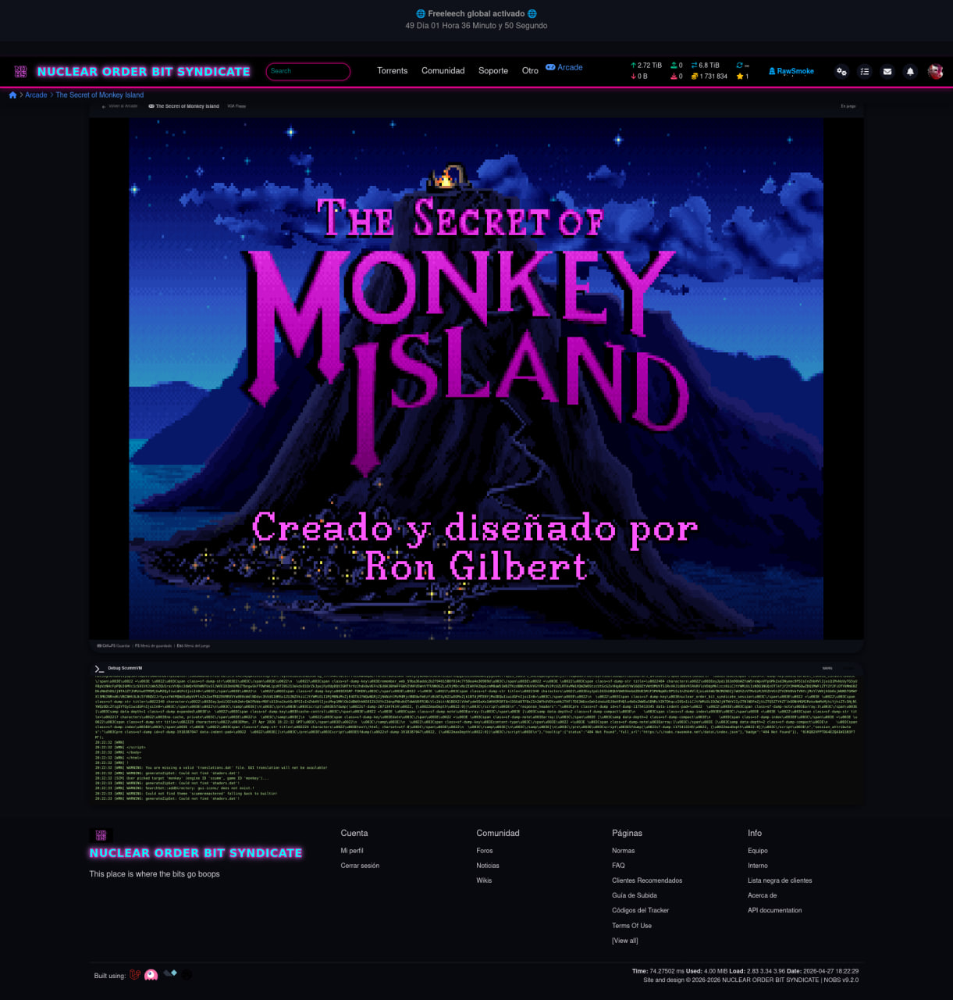

# 🎬 UNIT3D BÚNKER - Edición N.O.B.S

> **Un Tracker de Torrents Privado, Dockerizado y Curtido en Batalla**

```
███████████████████████████████████████████████████████████████
█                                                             █
█   🛡️  UNIT3D BÚNKER  |  Nuclear Order Bit Syndicate         █
█                                                             █
█   "From the Scene, For the Scene"                           █
█   2000+ hours of stabilization, automation, and resilience  █
█                                                             █
███████████████████████████████████████████████████████████████
```


> **⚠️ AVISO PARA NAVEGANTES:** Si vas a tocar el stack, deja el café un segundo y lee. Entrar aquí sin pasar por la wiki es como intentar desarmar una bomba con palillos chinos. Bajo tu propio riesgo.

---

<p align="center">
  <a href="https://rawsmoke.codeberg.page/UNIT3D/">
    
  </a>
  <a href="https://github.com/rawsmoketerribilus/UNIT3D/actions">
    
  </a>
</p>

---

### 📚 La Biblia de Operaciones
Todo lo que necesitas para que el tracker no explote está en nuestra Wiki oficial:

👉 **[ACCEDER AL MANUAL COMPLETO](https://rawsmoke.codeberg.page/UNIT3D/)**

**¿Qué encontrarás ahí dentro?**
* 🛠️ **Configuración del Entorno:** Cómo domar los contenedores sin morir en el intento.
* 💾 **Backups Blindados:** El sistema de snapshots que nos salva el culo a las 06:00 AM.
* 📑 **Guía de Desarrollo:** Para que el código nuevo no parezca escrito por el becario.
* 🏗️ **Testing:** Cómo montar un laboratorio de pruebas que no pese 22GB.

---

---

## 🧭 Índice

- [¿Qué es UNIT3D?](#-qué-es-unit3d)
- [¿Por qué N.O.B.S? Lo que Construimos](#-por-qué-nobs-lo-que-construimos)
  - [Parte 1 — Arreglamos las piezas rotas](#parte-1-arreglamos-las-piezas-rotas-de-unit3d)
  - [Parte 2 — Lo dockerizamos](#parte-2-lo-dockerizamos-no-es-una-tarea-trivial)
  - [Parte 3 — Añadimos resiliencia (Búnker)](#parte-3-añadimos-resiliencia-la-filosofía-búnker)
- [Mejoras Clave (22)](#-mejoras-clave)
- [Rutas de Instalación](#-rutas-de-instalación)
- [Gestión: El Makefile](#-gestión-el-makefile)
- [Arquitectura](#-arquitectura)
- [Mapeo de Puertos](#-mapeo-de-puertos)
- [Notas de Seguridad](#-notas-de-seguridad)
- [Solución de Problemas](#-solución-de-problemas)
- [Filosofía: De la Scene, Para la Scene](#-filosofía-de-la-scene-para-la-scene)
- [Contribuciones](#-contribuciones) · [Licencia](#-licencia) · [Agradecimientos](#-agradecimientos)

<details>
<summary><b>📂 Las 22 Mejoras Clave, una por una</b></summary>

1. [Meilisearch: búsqueda instantánea y resiliente](#1--meilisearch-búsqueda-instantánea-y-resiliente)
2. [Lista negra de correos resiliente](#2--lista-negra-de-correos-resiliente)
3. [Transparencia de IPs (redes de Docker)](#3--transparencia-de-direcciones-ip-redes-de-docker)
4. [Protección contra fuerza bruta equilibrada](#4--protección-contra-fuerza-bruta-equilibrio-entre-seguridad-y-usabilidad)
5. [Infraestructura autónoma (el "Búnker")](#5--infraestructura-autónoma-el-búnker)
6. [Branding de N.O.B.S (tema personalizado)](#6--branding-de-nobs-tema-personalizado)
7. [Ajustes de configuración](#7--ajustes-de-configuración)
8. [Tema Retro v2 (estética + fixes)](#8--refactorización-estética-y-funcional-tema-retro-v2)
9. [Integración con Telegram (bot)](#9--integración-con-telegram-bot-de-notificaciones)
10. [Sincronización cifrada a Google Drive](#10--sincronización-con-google-drive-rclone--cifrado)
11. [Metadata multi-proveedor con consenso](#11--metadata-multi-proveedor-con-consenso-tmdb--igdb--mal--anilist--imdb--tvmaze)
12. [Meta-Worker (cola dedicada de metadatos)](#12--meta-worker-cola-dedicada-para-refresco-de-metadatos)
13. [Swarm Intelligence + mapa 3D](#13--swarm-intelligence--mapa-3d-del-tracker)
14. [RetroArch Web (26 cores libretro)](#14--retroarch-web-arcade-multi-sistema-26-cores-libretro)
15. [Aislamiento COOP/COEP + proxy TMDB](#15--aislamiento-coopcoep--proxy-de-imágenes-tmdb-csp-compliant)
16. [Thanks Ratio + locale español](#16--thanks-ratio--localización-al-español-por-defecto)
17. [Endurecimiento del edge (nginx announce)](#17--endurecimiento-del-edge-nginx-announce--verificación)
18. [UI reactiva (trailers, flash cards, backdrops)](#18--ui-reactiva-trailers-flotantes-flash-cards-y-backdrops-de-freeleech)
19. [Base de datos profundamente modificada](#19--base-de-datos-profundamente-modificada-ya-no-es-unit3d-community)
20. [Super-paneles de staff (en FOSS)](#20--super-paneles-de-staff-administración-avanzada-en-foss)
21. [Arcade ScummVM WebAssembly](#21--arcade-integrado-scummvm-webassembly-pioneros)
22. [Banco forense y de recuperación (PITR)](#22--banco-de-forense-y-recuperación-point-in-time-aislado)

</details>

---

## 📚 ¿Qué es UNIT3D?

**[UNIT3D](https://github.com/HDInnovations/UNIT3D)** es un software moderno y rico en funciones para Trackers de Torrents Privados, construido sobre **Laravel 12**, **Livewire** y **AlpineJS**. Creado por el equipo de HDInnovations, impulsa comunidades de trackers privados de alto rendimiento con soporte para:

- 🔐 **Gestión Avanzada de Usuarios**: Roles, permisos, invitaciones, logros
- 🔍 **Integración con Meilisearch**: Búsqueda en milisegundos a través de millones de torrents
- 📊 **Analíticas Completas**: Estadísticas de torrents, actividad de usuarios, ratios de seedeo
- 🎨 **Sistema de Temas**: UI personalizable con Sass/CSS
- 📧 **Notificaciones por Correo**: Integración SMTP, alertas de actividad
- 🔗 **Integración IRC**: Anuncios en vivo e integración de bots
- 🌍 **Internacionalización**: Soporte para múltiples idiomas

### **Un Gran Agradecimiento a HDInnovations** ❤️

Este proyecto no existiría sin UNIT3D. Los desarrolladores originales crearon una plataforma increíble para comunidades de trackers privados. [**→ Visita el GitHub de UNIT3D**](https://github.com/HDInnovations/UNIT3D)

---

## 🔧 ¿Por qué N.O.B.S? Lo que Construimos

UNIT3D es una **plataforma brillante**, pero llega como código fuente, no como una implementación empaquetada. Tomamos la Edición Comunitaria e hicimos tres cosas: **arreglar** lo que venía roto, **dockerizar** el stack completo y **endurecerlo** para que opere solo (la filosofía "Búnker").

### **Parte 1: Arreglamos las Piezas Rotas de UNIT3D**

La Edición Comunitaria tenía **bugs sin corregir y funciones faltantes**:

| Problema | Impacto | Nuestra Solución |
|---|---|---|
| **Instalador no incluido** | La edición comunitaria no trae instalador; la instalación oficial automatizada se ofrece como servicio de pago de HDInnovations | Cubrimos la instalación por **dos vías propias y gratuitas**: (1) el `entrypoint.sh` de Docker hace el setup completo en cada arranque (migraciones, listas negras, caché, permisos), y (2) un **instalador *baremetal* reescrito desde cero** para Debian/Ubuntu en `Unit3d_9.2-Installer-fixed/Unit3d-installer-debian.sh` |
| **Meilisearch sin Configurar** | El motor de búsqueda se incluía pero no se indexaba ni sincronizaba | Implementamos indexación en arranque en frío, sincronización con observadores en tiempo real y protección con Llave Maestra |
| **Fuerza Bruta Demasiado Agresiva** | La configuración bloqueaba a usuarios legítimos (5 intentos = bloqueo de 24h) | Ajustamos FortifyServiceProvider (5→15 intentos, 24h→1h, creamos propietario de respaldo) |
| **Fragilidad de la Lista Negra de Correos** | El sistema se rompía si el CDN externo no era accesible | Creamos una caché local persistente (`storage/app/email-blacklist.json`) con un sistema de respaldo híbrido |

---

### **Parte 2: Lo Dockerizamos (No es una Tarea Trivial)**

El UNIT3D original **no es nativo de Docker**. Construimos la contenedorización completa:

| Desafío | Solución |
|---|---|
| **Servicios en Segundo Plano Faltantes** | Añadimos contenedores `scheduler` y `worker` con entrypoints dedicados |
| **Enmascaramiento de Direcciones IP** | Configuramos cabeceras de proxy inverso en Nginx + TrustProxies de Laravel (IPs reales en perfiles) |
| **Caos de Permisos en Contenedores** | Autoreparación en `entrypoint.sh` (chmod 775, chown www-data en el arranque) |
| **Enlace de Almacenamiento en Docker** | Configuramos montajes de volúmenes persistentes con los enlaces simbólicos correctos |
| **Sin Persistencia de Dependencias** | Incluimos `vendor/` y `node_modules/` en el repositorio (recuperación Plug & Play sin conexión) |

---

### **Parte 3: Añadimos Resiliencia (La Filosofía "Búnker")**

Más allá de arreglar y dockerizar, añadimos **características autónomas y orientadas al funcionamiento sin conexión**:

| Característica | Beneficio |
|---|---|
| **Estrategia de Backup en Frío** | Detener contenedores → copiar → reiniciar (cero corrupción, integridad de datos garantizada) |
| **Sincronización Cifrada a Google Drive** | Snapshots cifrados con rclone + contenedor efímero (recuperación off-site) |
| **Automatización de Health Check** | Monitoriza Nginx, Meilisearch, MySQL, Redis, scheduler, worker y endpoint announce |
| **Entrypoints de Autoreparación** | Apagar/encender → todo funciona (sin intervención manual) |
| **Cola Dedicada de Metadatos** | Worker aislado `meta-refresh` para que TMDB/MAL/IGDB no ahoguen la cola principal |
| **Tracker en Rust (UNIT3D-Announce)** | `/announce/` desacoplado de PHP, con sync en caliente desde Laravel |
| **Notificaciones a Telegram** | Bot vinculado por deep-link, kick automático en baneos, póster + mediainfo |
| **Control con Makefile** | `make up`, `make backup`, `make health`, `make meilisearch` (operaciones simples) |

**Resultado**: Un sistema listo para producción, autónomo y diseñado para **comunidades que gestionan su propia infraestructura**.

---

## 🚀 Mejoras Clave

### 1. **🔍 Meilisearch: Búsqueda Instantánea y Resiliente**

**El Desafío**: UNIT3D incluye Meilisearch como su motor de búsqueda, pero **no proporciona documentación ni configuración**. La instalación y configuración quedan a cargo del operador.

**Nuestra Solución**:

```
🏗️ INFRAESTRUCTURA:
  • Contenedor dedicado (getmeili/meilisearch:latest) en docker-compose.yml
  • Almacenamiento persistente de índices (volumen de Docker meilisearch-data)
  • Protección con Llave Maestra (MEILISEARCH_KEY en .env, nunca registrada en logs)

🔄 INICIALIZACIÓN:
  • Indexación en arranque en frío: entrypoint.sh ejecuta php artisan scout:import
  • Si faltan los índices, el sistema los reconstruye al arrancar (autoreparación)
  • Configuración: app/Http/Scout config mapea Torrent → Meilisearch

⚡ SINCRONIZACIÓN EN TIEMPO REAL:
  • Observadores de Laravel escuchan por torrents nuevos o actualizados
  • Indexación instantánea (milisegundos) a medida que los usuarios suben
  • Enriquecimiento de metadatos de TMDB/IGDB (pósters, géneros, valoraciones)

🛡️ RESILIENCIA:
  • Los índices sobreviven a los reinicios de los contenedores (persisten en el volumen)
  • Consulta de respaldo a MySQL si Meilisearch no está disponible
  • El Health Check monitoriza el endpoint /health
```

**Por qué es importante**: Buscar en más de 50,000 torrents toma **milisegundos** en lugar de segundos. La base de datos se mantiene ligera. Los usuarios obtienen resultados instantáneos y filtrados.

---

### 2. **📧 Lista Negra de Correos Resiliente**

**El Problema**: UNIT3D obtiene dominios de correo desechables de un CDN externo durante la validación del registro. **Si el CDN está caído o inaccesible, los registros fallan por completo.**

**Nuestra Solución - Estrategia de Lista Negra Híbrida**:

```
PRIMARIO (Online):
  ✅ Obtiene una lista actualizada del CDN (andreis/disposable-emails)
  ✅ Actualiza una vez al arrancar (php artisan auto:email-blacklist-update)

RESPALDO (Offline):
  ✅ Almacena una copia local: storage/app/email-blacklist.json
  ✅ Más de 7,160 dominios persistidos localmente
  ✅ Si el CDN no es accesible, usa la caché local (el registro sigue funcionando)

PERSISTENCIA:
  ✅ La caché sobrevive a los reinicios de los contenedores
  ✅ La caché sobrevive a `docker compose down/up`
  ✅ La caché se incluye en los backups completos
```

**Detalles de Implementación**:
- Se creó `app/Helpers/EmailBlacklistUpdater.php` (lógica de actualización automática)
- El entrypoint ejecuta `php artisan auto:email-blacklist-update` al arrancar
- Un comando de Artisan personalizado vigila el CDN y escribe en el JSON local
- El registro usa la caché local como principal (más rápido, fiable)

**Resultado**: El registro funciona **incluso si el CDN está caído**. El sistema es autónomo y capaz de funcionar sin conexión.

---

### 3. **🌐 Transparencia de Direcciones IP (Redes de Docker)**

**El Problema**: En Docker, Nginx y la aplicación Laravel se ejecutan en contenedores separados. Sin las cabeceras adecuadas, todas las peticiones parecen provenir de la puerta de enlace interna de Docker (`172.21.0.1`). **Todos los usuarios muestran la misma IP en sus perfiles.**

**Nuestra Solución - Cabeceras de Proxy Inverso + TrustProxies**:

```
CAPA DE NGINX (.docker/nginx/default.conf):
  • proxy_set_header X-Real-IP $remote_addr;
  • proxy_set_header X-Forwarded-For $proxy_add_x_forwarded_for;
  • proxy_set_header X-Forwarded-Proto $scheme;

CAPA DE LARAVEL (app/Http/Middleware/TrustProxies.php):
  • protected $proxies = '*';  [Confiar en Nginx como proxy inverso]
  • Lee la cabecera X-Real-IP y la usa como la IP de origen del usuario

RESULTADO:
  ✅ IPs reales de los usuarios capturadas en la base de datos
  ✅ Cada usuario ve su IP pública real en su perfil
  ✅ El baneo y las estadísticas basadas en IP funcionan correctamente
```

**Verificación**: Inicia sesión, visita tu perfil → verás tu IP pública real, no la puerta de enlace de Docker.

---

### 4. **🔒 Protección contra Fuerza Bruta: Equilibrio entre Seguridad y Usabilidad**

**El Problema**: La configuración por defecto de Fortify en UNIT3D era **demasiado agresiva**:
- 5 inicios de sesión fallidos → bloqueado por 24 horas
- IP de puerta de enlace compartida única (172.21.0.1 en Docker) → usuarios legítimos bloqueados juntos
- Resultado: **Los desarrolladores se bloqueaban a sí mismos durante las pruebas/recuperación**

**Nuestro Ajuste** (`app/Providers/FortifyServiceProvider.php`):

```php
// Antes (demasiado estricto):
RateLimiter::for('login', 5 intentos por minuto);      // 5 fallos = bloqueo
$throttleKey = hashless unique attempt;

// Después (equilibrado):
RateLimiter::for('login', 15 intentos por minuto);     // 15 fallos = bloqueo
RateLimiter::for('two-factor', 6 intentos por minuto); // 2FA más indulgente
Duración del bloqueo: 24h → 1h                          // Recuperación más rápida
Verificación de multi-cuenta: umbral de 1 → 3           // Permite cambiar de cuenta
```

**Seguridad Adicional**:
- Se creó la cuenta `BackupOwner` con permisos completos (acceso de emergencia)
- Se puede usar la cuenta de respaldo si la principal está bloqueada
- Los logs rastrean los intentos fallidos para investigar ataques reales

**Resultado**: El sistema protege contra la fuerza bruta **mientras permite la recuperación y pruebas legítimas**.

---

### 5. **🛡️ Infraestructura Autónoma (El "Búnker")**

#### **Autoreparación al Iniciar**

Cada arranque de contenedor desencadena una recuperación automática:

```bash
# .docker/entrypoint.sh hace lo siguiente:
✅ Copia .env.example → .env (si .env no existe)
✅ composer install (si vendor/ no existe)
✅ npm install + build (si public/build/ no existe)
✅ Crea carpetas de almacenamiento
✅ Arregla permisos (chmod 775, chown www-data)
✅ Espera a MySQL
✅ Genera APP_KEY (si no existe)
✅ Ejecuta migraciones (--force)
✅ Actualiza la lista negra de correos
✅ Inicia PHP-FPM
```

**Resultado**: Apaga el servidor, enciéndelo → todo funciona. Sin intervención manual.

---

#### **Backup en Frío (Snapshot Quirúrgico)**

**Filosofía**: Los backups deben ser **a prueba de corrupción, completos y fáciles de restaurar**.

```bash
Flujo de trabajo de ./backup.sh:

1. 💾 Volcado de MySQL (volcado en caliente, --no-tablespaces para MySQL 8)
   └─ Captura el estado de la base de datos sin problemas de bloqueo

2. 🛑 Congelación de Contenedores (docker compose stop)
   └─ Detiene todos los contenedores para un snapshot de archivos consistente

3. 📂 Archivo Completo (tar -czf)
   └─ Comprime: código de la aplicación, vendor/, node_modules/, configuraciones, datos
   └─ Incluye el árbol del proyecto y la receta exacta del despliegue

4. 🧳 Espejo Externo Opcional
   └─ Copia el snapshot a `BACKUP_EXTERNAL_DIR` si `BACKUP_EXTERNAL_ENABLED=true`
   └─ Mantiene su propia rotación para tener una segunda copia local fuera del árbol principal

5. ♻️ Rotación (local + externa)
   └─ `BACKUP_LOCAL_RETENTION` controla la rotación local
   └─ `BACKUP_EXTERNAL_RETENTION` controla la rotación de la copia en disco externo

6. 🚀 Resurrección (docker compose up)
   └─ Verifica que el backup se haya realizado con éxito
   └─ Reinicia el sistema inmediatamente (minimiza el tiempo de inactividad)
```

**¿Por qué "quirúrgico"?**:
- ✅ **Sin corrupción**: Detener los contenedores asegura la consistencia de los archivos durante la copia
- ✅ **Plug & Play**: Se incluyen `vendor/` y `node_modules/` completos
- ✅ **Copia secundaria integrada**: El snapshot puede reflejarse automáticamente a un disco externo con rotación propia
- ✅ **Atómico**: Snapshot completo en un único punto en el tiempo

---

#### **Health Checks (Chequeos de Salud)**

```bash
make health  # Ejecuta ./health_check.sh

Chequeos:
✅ La URL principal responde con HTTP 200/302
✅ Endpoint /health de Meilisearch
✅ Conectividad con MySQL
✅ Conectividad con Redis
✅ El worker de la cola está vivo
✅ El scheduler se está ejecutando
✅ Endpoint announce opcional si `ANNOUNCE_HEALTHCHECK_URL` está configurado

Si alguno falla: Alertas + puede reiniciar automáticamente
```

---

#### **Rust Announce (Implementación Externa del Tracker)**

La ruta `/announce/` ya no depende del controlador PHP clásico. Ahora se sirve mediante un servicio dedicado `announce` en Docker que ejecuta **UNIT3D-Announce** en Rust.

```bash
Arquitectura actual:

Internet/Cloudflare
    ↓
Nginx (`web`)
    ↓  proxy /announce/
Rust tracker (`announce:6969`)
    ↓  API interna
Laravel (`app`) → Unit3dAnnounce::*
```

Puntos importantes:
- ✅ **Código vendorizado en el repo**: `rust-announce/UNIT3D-Announce`
- ✅ **Sin submódulos, sin symlinks, sin hardlinks** en el árbol vendorizado de producción
- ✅ **IP real del cliente** reenviada al tracker por `CF-Connecting-IP` / `X-Real-IP`
- ✅ **Admin API del tracker bloqueada públicamente** en nginx (`/announce/{TRACKER_KEY}/...`)
- ✅ **Healthcheck dedicado** en `/announce/health/ping`
- ✅ **Rollback simple**: cambiar `TRACKER_ENABLED=false` en `.env` y reiniciar `app/scheduler/worker/web`

Variables relevantes:
- `TRACKER_ENABLED`
- `TRACKER_HOST=announce`
- `TRACKER_PORT=6969`
- `TRACKER_KEY`
- `ANNOUNCE_HEALTHCHECK_URL`

Implicaciones operativas:
- `backup.sh` ya captura el código del tracker porque forma parte del árbol del proyecto
- `disaster-recovery-script.sh` ya reconstruye el servicio al hacer `docker compose up -d`
- el dashboard sigue pudiendo leer estadísticas del tracker externo mediante `Unit3dAnnounce::getStats()`

---

### 6. **🎨 Branding de N.O.B.S (Tema Personalizado)**

UNIT3D viene con un tema por defecto. Creamos una identidad personalizada de N.O.B.S:

- **Tema SCSS Personalizado**: `resources/sass/themes/_refined-nobs.scss`
  - Estética neón cian/rosa
  - Paneles de glassmorphism con efectos de desenfoque
  - Tipografía industrial y de bloques

- **Personalización de Activos**:
  - **Favicon**: Icono de medalla de NOBS personalizado de 64x64
  - **Logo**: Marca de NOBS en las páginas de inicio de sesión/registro
  - **Imagen OG**: Imagen para compartir en redes sociales
  - **Páginas de Autenticación**: Fondos y estilos personalizados

- **Extensibilidad Fácil**:
  - Todos los estilos en Sass (variables temáticas)
  - Compilado con Vite (`npm run build`)
  - Cambia de tema a través del panel de administración o `config/other.php`

Esto **no es un cambio en el núcleo de UNIT3D** — es una piel personalizada que respeta la plataforma original.

---

### 7. **⚙️ Ajustes de Configuración**

Optimizaciones en **config/other.php**:
- Tiempo de espera para invitaciones: 24h → 1h (después de la activación de 2FA)
- Máximo de invitaciones sin usar por usuario: 1 → 10 (amigable para el staff)
- Subtítulo del sitio: Contextualizado para N.O.B.S
- Correo de respaldo: Valor por defecto seguro si falta en .env

**Endurecimiento de la seguridad**:
- `SESSION_SECURE_COOKIE=true` (solo HTTPS)
- `SESSION_DOMAIN=nobs.rawsmoke.net` (dominio explícito)
- `TRUSTED_PROXIES=*` (para cadenas de proxy inverso)

---

### 8. **🎨 Refactorización Estética y Funcional: Tema Retro (v2)**

**El Desafío**: El tema original `refined_nobs` presentaba problemas críticos de UX/UI: menús desplegables inaccesibles por conflictos de capas (z-index), botones que aparecían como bloques negros sin relieve, y una saturación de color rosa que dificultaba la lectura prolongada. Además, los ratios de torrents mostraban errores técnicos (`INF` o código HTML fugado).

**Nuestra Solución (v2)**:

```
🚀 UI/UX REIMAGINADA:
  • Base Dark Mode Profundo (#050507) con acentos neón (Púrpura a Fucsia) y Cyan.
  • Corrección de Dropdowns: Ajuste de z-index y efectos hover para navegación fluida.
  • Botones Profesionales: Bordes suavizados (6px), gradientes sutiles e iconos blancos.
  • Legibilidad: Zebra-striping en todas las tablas y paneles de datos centrados.

🛠️ FIXES TÉCNICOS:
  • Ratio "INF" corregido: Sustituido por el símbolo de infinito (∞) más elegante.
  • HTML Leak: Eliminación del código literal en las tablas de historia de torrents.
  • Optimización Blade: Uso de directivas @class para un renderizado robusto y limpio.
```

**Resultado**: Una interfaz moderna, elegante y funcional que respeta la estética Cyberpunk/Synthwave de N.O.B.S sin sacrificar la usabilidad ni la claridad de los datos.

---

### 9. **📡 Integración con Telegram (Bot de Notificaciones)**

**El Desafío**: UNIT3D no incluye ningún canal de notificaciones externo en tiempo real. Los usuarios no reciben alertas cuando se aprueba un torrent, y el staff no puede actuar sobre los miembros del grupo de Telegram directamente desde la plataforma.

**Nuestra Solución**:

```
🤝 VINCULACIÓN DE CUENTA (Deep-Link Handshake):
  • Cada usuario recibe un token único con formato TRK-XXXXXXXX al registrarse
  • El usuario inicia /start TRK-xxx con el bot → se vincula su chat_id a su cuenta
  • La transacción usa lockForUpdate() para evitar condiciones de carrera
  • Ruta: POST /api/telegram/webhook (excluye throttle:api, auth:api, banned)

📢 NOTIFICACIONES DE TORRENTS:
  • TorrentObserver dispara SendTelegramNotification cuando status → APPROVED
  • Job con colas ($tries=3, $backoff=[10,60,300], $timeout=30)
  • Mensaje enriquecido: póster, mediainfo completo (codec, resolución, audio,
    bitrate, framerate, ratio de aspecto, duración), banderas de idioma (40+ idiomas)
  • Botones inline: IMDb / TMDb / Tráiler / Descargar

🚫 BAN → EXPULSIÓN AUTOMÁTICA:
  • Al banear un usuario en UNIT3D, BanController llama a TelegramService::kickUser()
  • Implementación limpia: banChatMember + unbanChatMember inmediato (expulsión, no ban permanente)
  • Se limpian telegram_chat_id y telegram_token del usuario baneado

🔗 INVITACIÓN AL GRUPO:
  • Los usuarios vinculados reciben el enlace de invitación al grupo vía bot
  • El enlace se preserva íntegro usando Http::asJson() (mantiene el + en las URLs)

🛠️ COMANDOS DEL BOT:
  • /start TRK-xxx — vinculación de cuenta
  • /status        — muestra si la cuenta está vinculada
  • /help          — ayuda del bot
```

**Variables de Entorno Requeridas**:

| Variable | Descripción |
|---|---|
| `TELEGRAM_BOT_TOKEN` | Token del bot (obtenido de @BotFather) |
| `TELEGRAM_GROUP_ID` | ID del supergrupo (número negativo, ej: -1001234567890) |
| `TELEGRAM_TOPIC_NOVEDADES` | ID del hilo/topic para anuncios de torrents |
| `TELEGRAM_BOT_USERNAME` | @username del bot sin la @ |
| `TELEGRAM_GROUP_INVITE_LINK` | Enlace de invitación al grupo (t.me/+xxxxx) |

**Resultado**: Los usuarios reciben notificaciones instantáneas de nuevos torrents directamente en Telegram, con póster e información técnica completa. Ver [`docs/TELEGRAM_INTEGRATION_GUIDE.md`](./docs/TELEGRAM_INTEGRATION_GUIDE.md) para la guía completa de configuración.

---

### 10. **☁️ Sincronización con Google Drive (rclone + cifrado)**

**El Desafío**: Los snapshots locales del backup en frío quedan en el mismo servidor. Un fallo de disco o pérdida del host implica pérdida total de los backups.

**Nuestra Solución - Sincronización Cifrada con Contenedor Efímero**:

```
🐳 PATRÓN EFÍMERO:
  • Contenedor rclone/rclone:latest que se crea, sincroniza y destruye (--rm)
  • Sin estado persistente: el contenedor no queda corriendo en segundo plano
  • Orchestrado desde rclone_gdrive/docker-compose.yml

🔐 CIFRADO TRANSPARENTE:
  • Remote gdrive_crypt: cifra los archivos antes de subirlos a Google Drive
  • La clave de cifrado reside en rclone_gdrive/config/rclone.conf (git-ignored)
  • Los archivos en Drive son ilegibles sin la clave — privacidad garantizada

⚙️ PARÁMETROS DE SINCRONIZACIÓN:
  • --drive-chunk-size 1024M  (evita timeouts en archivos grandes)
  • --transfers 4 / --checkers 8  (paralelismo controlado)
  • --delete-after  (borra en destino solo si la subida fue exitosa)

♻️ RESTAURACIÓN:
  • rclone_gdrive/scripts/restore_snapshot.sh — interactivo
  • Lista los backups disponibles en la nube, solicita el nombre del objetivo
  • Descarga y desencripta automáticamente a restauracion_emergencia/

📋 LOGS:
  • rclone_gdrive/logs/sync_execution.log  (salida detallada de rclone)
  • rclone_gdrive/logs/cron_wrapper.log    (registro de ejecuciones de cron)
```

**Uso**:

```bash
# Sincronización manual
bash rclone_gdrive/scripts/run_sync.sh

# Restaurar un snapshot desde la nube
bash rclone_gdrive/scripts/restore_snapshot.sh

# Automatizar con cron (ejemplo: diario a las 07:00)
0 7 * * * /home/rawserver/UNIT3D_Docker/rclone_gdrive/scripts/run_sync.sh
```

**Resultado**: Los snapshots locales se sincronizan cifrados a Google Drive. La recuperación ante desastres funciona incluso si el servidor físico desaparece por completo.

---

### 11. **🧬 Metadata Multi-Proveedor con Consenso (TMDB · IGDB · MAL · Anilist · IMDb · TVmaze)**

**El Desafío**: La Edición Comunitaria solo habla con TMDB. Si el match es ambiguo (título genérico, año confuso, animes con varias versiones), el póster, sinopsis y géneros terminan equivocados — y el operador acaba editando torrents a mano.

**Nuestra Solución — `ConsensusResolver`**:

```
🔍 6 PROVEEDORES EN PARALELO:
  • TmdbClient   — películas + series (autoritativo para media occidental)
  • ImdbClient   — fallback de fichas y ratings cuando TMDB falla
  • TvmazeClient — calendario y datos episódicos de TV
  • MalClient    — anime (MyAnimeList API + scraper como respaldo)
  • AnilistClient — anime/manga GraphQL (votos cruzados con MAL)
  • IgdbClient   — videojuegos (categoría aparte, no se mezcla con cine)

🗳️ ALGORITMO DE CONSENSO:
  • Cada proveedor devuelve un score normalizado (título + año + tipo)
  • Hits con score por debajo del umbral NO votan (evita ruido)
  • Voto mayoritario decide canonical_id y artwork
  • Empates se rompen con prioridad por categoría (anime→MAL, cine→TMDB, juegos→IGDB)

🖼️ ARTWORK ROTATIVO:
  • Cada torrent guarda N pósters en `metadata_artwork`
  • `meta:rotate-covers` rota el póster activo para que el catálogo respire visualmente
  • Tabla `metadata_resolutions` audita qué proveedor ganó y por qué
```

**Componentes**:
- `app/Services/Metadata/ConsensusResolver.php` — orquestador del voto
- `app/Services/Metadata/*Client.php` — un cliente por proveedor
- Tablas: `metadata_resolutions`, `metadata_artwork`, `mal_anime`
- Comandos: `meta:sync`, `meta:refresh-dispatch`, `meta:rotate-covers`, `fetch:meta`, `sync:missing-trailers`

**Resultado**: Match de metadatos mucho más robusto, especialmente en anime (donde TMDB es históricamente débil) y en títulos con colisiones de nombre.

---

### 12. **🛰️ Meta-Worker (Cola Dedicada para Refresco de Metadatos)**

**El Desafío**: Refrescar metadatos puede colgar la cola principal: rate-limits de TMDB, scrapes lentos de MAL, timeouts de IMDb. Si comparten queue, las notificaciones de Telegram se atascan detrás de un scrape de 30 segundos.

**Nuestra Solución — Worker Aislado**:

```yaml
meta-worker:
  entrypoint: /usr/local/bin/entrypoint-worker.sh
  environment:
    QUEUE_WORK_QUEUES: meta-refresh
    QUEUE_WORK_TIMEOUT: 300
```

```
🚦 SEPARACIÓN DE COLAS:
  • Cola `default`  → worker normal (Telegram, mails, jobs ligeros)
  • Cola `meta-refresh` → meta-worker (TMDB/IGDB/MAL/Anilist/IMDb)
  • Timeout extendido (300s) para tolerar APIs lentas
  • Sin contención: un scrape colgado no afecta a notificaciones

⏰ DISPATCH AUTOMÁTICO:
  • `php artisan meta:refresh-dispatch --limit=5 --stale-hours=720 --dispatch-ttl-minutes=10`
  • Corre cada minuto desde el scheduler
  • TTL de despacho evita re-encolar trabajos en vuelo
  • Refresca metadatos de torrents con más de 30 días sin actualizar
```

**Resultado**: La UI sigue rápida mientras el catálogo se reindexa en segundo plano. La cola crítica nunca se ahoga.

---

### 13. **🕸️ Swarm Intelligence + Mapa 3D del Tracker**

**El Desafío**: El operador no tiene visibilidad de la topología real del swarm. ¿Quién comparte con quién? ¿Hay cliques? ¿Hay un nodo central que si se cae fragmenta el swarm?

**Nuestra Solución — Dos Vistas Inéditas**:

```
📊 SWARM INTEL (página de torrent):
  • Componente Livewire plegable incrustado en cada ficha (`torrent/show.blade.php`)
  • Se carga por torrent vía <livewire:swarm-intelligence :torrentId="$torrent->id" />
  • Distribución geográfica de peers (banderas, ASN, ISP)
  • Histograma de clientes BitTorrent
  • Detección de patrones sospechosos (mismo ASN, ventanas idénticas)
  • Panel foldable: el staff/usuario lo abre solo cuando necesita inteligencia, sin ensuciar la página principal

🌐 MAPA 3D INTERACTIVO (sección Community):
  • Grafo de fuerza 3D renderizado en WebGL (three.js + 3d-force-graph)
  • Nodos = usuarios, aristas = co-seedeo en torrents comunes
  • Filtros por categoría, rol, actividad
  • Visualización en tiempo casi real (refresco periódico)
```

**Stack técnico**:
- `app/Http/Controllers/SwarmGraphController.php` — API del grafo
- `resources/views/livewire/swarm-intelligence.blade.php` — vista por torrent
- `resources/views/swarm/*` — visor 3D
- Vendor JS bajo `public/vendor/` (force-graph, 3d-force-graph, three, d3) — **gitignored**
- `install-swarm-assets.sh` — descarga las libs en clonado fresco / rebuild

**Resultado**: Primer fork público de UNIT3D con visualización 3D del swarm. Útil para detectar abuso, medir salud comunitaria y, francamente, queda increíble.

---

### 14. **🎮 RetroArch Web (Arcade Multi-Sistema, 26 Cores Libretro)**

**El Desafío**: ScummVM cubre point-and-click clásico, pero el catálogo retro de verdad vive en NES, SNES, Mega Drive, Game Boy, PS1, arcade Capcom/Neo Geo. Hacía falta un emulador genérico en el navegador.

**Nuestra Solución — RetroArch Compilado a WebAssembly**:

```
🕹️ 26 CORES LIBRETRO EN public/retroarch/:
  • fceumm (NES), snes9x (SNES), genesis_plus_gx (Mega Drive/SMS/GG)
  • gambatte (Game Boy/GBC), mgba (GBA), mednafen_psx (PS1)
  • fbneo (arcade), pcsx_rearmed, ecwolf (Wolfenstein 3D), …
  • Lista completa en core_list.js

🔐 AUTH-WALL:
  • /retroarch/* protegido tras sesión de Laravel (no scraping anónimo)
  • Middleware `gaming.isolation` aplica COOP/COEP en la página show
  • Páginas index/show separadas: catálogo abierto a miembros, reproductor aislado

📦 BIBLIOTECA Y CUBIERTAS:
  • Cubiertas vía `retroarch:fetch-covers`
  • Escaneo de ROMs con `retroarch:scan-roms`
  • ROMs gitignoreadas — solo skeleton + README por sistema en git
  • Modo `?debug` para diagnosticar arranques fallidos de core
```

**Componentes**:
- `app/Http/Controllers/RetroArchController.php`
- `public/retroarch/` (gitignored salvo skeleton + core_list.js)
- Comandos: `retroarch:fetch-covers`, `retroarch:scan-roms`

**Resultado**: NES, SNES, Mega Drive, PS1 y más, jugables directamente en el navegador del miembro. Cero instalaciones, sesión Laravel como única puerta.

---

### 15. **🛡️ Aislamiento COOP/COEP + Proxy de Imágenes TMDB (CSP Compliant)**

**El Desafío**: Para que ciertos cores libretro y módulos WASM funcionen, hace falta `Cross-Origin-Opener-Policy: same-origin` + `Cross-Origin-Embedder-Policy: require-corp`. Pero entonces el navegador bloquea pósters de `image.tmdb.org` por faltar `Cross-Origin-Resource-Policy`. Conflicto.

**Nuestra Solución — Middleware Selectivo + Proxy Local**:

```
🧱 MIDDLEWARE gaming.isolation:
  • Aplicado SOLO a /gaming/{id} y /retroarch/{system}/show
  • Inyecta COOP/COEP únicamente donde hace falta WASM aislado
  • El resto del sitio sigue sin restricciones (rendimiento intacto)

🖼️ TMDB IMAGE PROXY:
  • Ruta /tmdb-proxy/{size}/{file} → TmdbImageProxyController
  • Sirve imágenes TMDB desde el mismo origen (cumple CSP img-src 'self')
  • Cache HTTP largo en la capa nginx
  • Transparente para las vistas: helpers reescriben las URLs

🔐 CSP LIMPIO:
  • Sin nonces dinámicos por petición (KISS)
  • Inline JS minimizado, vendor bajo /vendor/
  • Cabeceras consolidadas en nginx + capa Laravel
```

**Resultado**: WASM aislado funcionando y pósters mostrándose, todo en el mismo dominio, sin abrir agujeros en la CSP global.

---

### 16. **🤝 Thanks Ratio + Localización al Español por Defecto**

**Thanks Ratio**:
- Métrica de "agradecimientos recibidos / agradecimientos enviados" expuesta en perfil, top-nav, y en formularios de invitaciones/BON.
- Incentiva participación más allá del ratio de seedeo crudo.
- Integrada en `User`, `InviteController`, `TransactionController`.

**Localización**:
- Locale por defecto migrado de `en` → `es` (`change_locale_default_to_es_in_user_settings`).
- Traducción completa de audit logs, downloads, reports, subtitles, tools, configuración de usuario y secciones de perfil.
- Componentes Blade nuevos para botones de comando del staff y condicionales de perfil.
- `show_poster` activo por defecto (mejor primera impresión en catálogo nuevo).

**Perfil Autoexplicativo — "Condiciones que te aplican"**:
- Parcial nueva en `resources/views/user/profile/partials/my-conditions.blade.php`, integrada en `user/profile/show.blade.php`.
- Expone al usuario, sin ambigüedades, qué reglas le afectan realmente:
  - Freeleech (por sitio, por grupo o ambos)
  - Double upload
  - Ratio mínimo efectivo (global o override de grupo)
  - Hit & Run: seed mínimo, gracia, avisos máximos, expiración
  - Slots de descarga
- Resultado: menos tickets absurdos de "¿por qué a mí sí/no me cuenta esto?" y menos staff haciendo de calculadora humana.

---

### 17. **🔒 Endurecimiento del Edge (Nginx Announce + Verificación)**

**Nginx Announce Hardening** (`.docker/nginx/default.conf`):
- Límites de conexión por IP en `/announce/`
- Timeouts ajustados (lectura/escritura cortos, evita conexiones zombies)
- Admin API del tracker Rust (`/announce/{TRACKER_KEY}/...`) bloqueada al exterior
- Healthcheck público solo en `/announce/health/ping`

**Flujo de Verificación Endurecido**:
- Rate-limit propio en `/email/verify-link/{id}/{hash}` (GET y POST)
- Tokens single-use, expiración corta
- Logs explícitos de intentos fallidos
- Registro resiliente: backoff en `RegisterController`, validación reforzada contra dominios desechables (lista local), `ApplicationController` y flujo de aplicación con throttling separado para que los bots no asfixien el formulario público

**Comandos de Sincronización con Tracker Rust**:
- `tracker:sync-users` — empuja cambios de usuarios al tracker en caliente
- `tracker:sync-torrents` — re-sincroniza catálogo
- `tracker:sync-groups` — actualiza permisos por grupo
- Útiles tras restore de backup o cambios masivos de permisos

---

### 18. **🎞️ UI Reactiva: Trailers Flotantes, Flash Cards y Backdrops de Freeleech**

**El Desafío**: La lista de torrents de UNIT3D es texto plano: título, tamaño, ratio. El usuario tiene que abrir cada ficha para ver de qué va el contenido. Los pósters quedan escondidos. La portada de freeleech es un banner liso.

**Nuestra Solución — Metadata Pulverizada por Toda la UI**:

```
🎬 TRAILER FLOTANTE EN HOVER (sobre el nombre del torrent):
  • Componente Alpine.js en components/torrent/row.blade.php
  • Detecta clave de YouTube vía $meta->trailer o regex sobre description
  • Embed youtube-nocookie con autoplay+mute+loop+modestbranding
  • Fallback automático al póster si el video reporta onError (150/101)
  • Delays calculados (400ms enter / 150ms leave) — no se dispara con paseos rápidos

🪪 FLASH CARD CON MEDIAINFO + TRAILER EMBEBIDO (botón quick-view):
  • Botoncito junto al torrent abre una tarjeta lado a lado:
    Trailer YouTube (autoplay) │ MediaInfo resumido (codec, res, audio, bitrate)
  • Layout grid 1fr 1fr si hay ambos, 1fr si solo hay uno
  • Thumbnail HD del trailer con fallback a hqdefault
  • Cero peticiones extra: la metadata viaja con la fila del torrent

🃏 FLASH CARD DE TMDB EN MINIATURAS:
  • Hover sobre el póster mini → tarjeta con sinopsis, género, rating, año
  • Tirando del ConsensusResolver: el mismo voto que decide el poster decide la card
  • Sin scrapeo extra en cliente — todo desde el caché local

🌌 BACKDROPS DINÁMICOS EN BANNER DE FREELEECH (resources/views/partials/alerts.blade.php):
  • AlertsComposer (app/View/Composers/AlertsComposer.php) selecciona 10 backdrops
  • Top torrents por seeders + completados (cache::flexible 900/1800)
  • Imágenes servidas vía /authenticated-images/tmdb-proxy/{size}/{file}
  • Cumple CSP img-src 'self' incluso con COOP/COEP global activa
  • Las URLs de image.tmdb.org se reescriben on-the-fly antes de renderizar

🔖 BOOKMARKS REFINADOS:
  • Botón muestra contador en vivo de cuántos usuarios lo han marcado
  • Estado filled/outlined según si es propio
  • Tooltip "Bookmarked by N users" (señal social útil sin filtrar identidades)
```

**Resultado**: El catálogo deja de ser una tabla y pasa a ser un escaparate. El usuario navega con preview cinematográfico antes de decidir qué descargar. **Todo apoyado en los 6 proveedores de metadatos — TMDB, IGDB, MAL, Anilist, IMDb, TVmaze cagando bits por todo el tracker.**

---

### 19. **🗄️ Base de Datos Profundamente Modificada (Ya No es UNIT3D Community)**

**El Estado**: Tras 2000+ horas, la DB de este fork ya no es reconocible para alguien que clone UNIT3D Community Edition y mire `database/migrations/`.

**Total de migraciones**: 376 archivos en `database/migrations/`. De ellas, 10 son aportes propios de N.O.B.S construidos sobre las migraciones originales:

| Migración | Propósito |
|---|---|
| `2026_03_08_000000_create_settings_table.php` | Tabla de settings dinámicos del tracker (sustituye constantes hardcodeadas) |
| `2026_03_24_010501_add_telegram_fields_to_users_table.php` | `telegram_chat_id`, `telegram_token`, `telegram_username` por usuario |
| `2026_03_27_000001_create_disposable_email_domains_table.php` | Lista negra de dominios desechables persistida en DB (no en JSON volátil) |
| `2026_04_27_000001_create_game_saves_table.php` | Partidas guardadas por usuario para el arcade ScummVM |
| `2026_05_10_000600_add_telegram_group_joined_at_to_users_table.php` | Auditoría de cuándo un usuario entró al grupo de Telegram |
| `2026_05_11_000000_change_locale_default_to_es_in_user_settings.php` | Locale por defecto migrado a `es` |
| `2026_05_12_000000_default_show_poster_to_true_in_user_settings.php` | `show_poster` activo por defecto en nuevas cuentas |
| `2026_05_17_000001_create_mal_anime_table.php` | Caché local de anime de MyAnimeList (evita rate-limit de scrapeo) |
| `2026_05_22_000001_create_metadata_resolutions_table.php` | Auditoría de votos del ConsensusResolver por torrent |
| `2026_05_22_000002_create_metadata_artwork_table.php` | Almacén multi-poster por torrent (artwork rotativo) |

**Implicaciones operativas**:
- ⚠️ **No intentes migrar este fork contra una DB de UNIT3D Community vanilla** — las tablas extra son obligatorias para que arranquen Telegram, arcade y resolver multi-proveedor.
- ⚠️ **`migrate:fresh` está prohibido en producción** — borra todo el catálogo, todos los logs, todas las partidas guardadas, toda la auditoría de metadatos.
- ✅ Para restaurar usa **Ruta B (Restaurar desde Backup)** — los backups capturan el SQL completo, incluyendo todas las migraciones aplicadas.
- ✅ Los seeders no rellenan tablas N.O.B.S — la lista de dominios desechables se siembra desde `EmailBlacklistUpdater::sync()`, la metadata se rellena vía `meta:sync` y `meta:refresh-dispatch`.

**Resultado**: La DB es ahora una extensión coherente de UNIT3D, no un parche pegado encima. Cualquier feature N.O.B.S tiene su tabla, su migración y su lugar en el backup.

---

### 20. **🎛️ Super-Paneles de Staff (Administración Avanzada, en FOSS)**

**Contexto**: UNIT3D Community Edition viene con un Staff Dashboard funcional pero básico. Los paneles avanzados de administración — los que de verdad usa el operador a diario — no formaban parte de la edición pública. Ningún fork público de UNIT3D los había construido.
**Lo único que vimos fue una foto borrosa de uno**. Una semana de diseño en papel después, empezamos. Lo que sigue lleva 2000+ horas de iteración encima — y algún nuke por accidente del tracker que duele recordar.

#### **Comparativa Directa con Community Edition**

| Métrica | Community Edition | NOBS Fork | Delta |
|---|---|---|---|
| Métodos en `CommandController` | 9 | **34** | +25 acciones |
| Carpeta `app/Http/Livewire/Staff/` | **no existe** | presente (`ConfigManager`) | +∞ |
| Paneles temáticos en `/staff/commands` | 1 lista plana | **9 paneles con iconos** | +8 |
| Rutas Staff totales | 257 | 282 | +25 |
| Panel de configuración global del sitio | **inexistente** (editas `.php` a pelo) | UI Livewire con 6 grupos, 25 ajustes hot-swap | nuevo |
| Métodos en `UserController` (Staff) | 4 | 5 (`telegramInfo`) | +1 |

#### **§20.1 — Command Panel: De Lista Plana a Centro de Operaciones**

La versión Community es una sola lista vertical de 8-9 botones (clear cache, maintenance, test email). La nuestra es un **centro de operaciones segmentado en 9 paneles temáticos con iconos**:

```
🛡️ Mantenimiento y Control del Sitio   (fa-shield-alt)
   • Activar/desactivar modo mantenimiento
   • Toggle invite-only
   • Crear storage:link

⚡ Caché y Rendimiento                    (fa-bolt)
   • Clear cache / view / route / config
   • Optimize:clear (Laravel + OPcache)
   • Set all cache (precaching agresivo)
   • Flush queue

☢️ Operaciones de Datos Críticas         (fa-radiation, estilo danger)
   • Acciones destructivas confinadas a UN panel rojo
   • Confirmación explícita antes de cada disparo
   • Logs persistentes de quién apretó qué y cuándo

🎬 TMDB                                   (fa-film)
   • Sync de trailers faltantes (normal y --force)
   • Rotate covers (artwork rotativo)

📡 Rust Tracker — Sincronización          (fa-broadcast-tower)
   • Sync de users / torrents / groups con UNIT3D-Announce
   • Útil tras restore o cambio masivo de permisos

🌱 Gestión de Peers y Torrents            (fa-seedling)
   • Flush old peers / reset user flushes
   • Sync peers / sync torrents
   • Limpieza quirúrgica del state del tracker

👥 Usuarios y Limpieza                    (fa-users)
   • Ban masivo de cuentas con email desechable
   • Desactivar warnings caducados
   • Generar tokens de Telegram en lote
   • Clean failed login attempts

🧪 Pruebas y Utilidades                   (fa-flask)
   • Test email (con resultado en pantalla, no en logs)
   • Set Telegram webhook
   • Fix Meilisearch + reindex scout
   • Meilisearch full repair (nuke + rebuild)
   • Update email blacklist desde CDN

🔎 Metadata — Identificación              (fa-fingerprint)
   • meta:sync y meta:sync --force
   • Rotar póster activo
   • Re-resolver torrents huérfanos
```

**Componente reutilizable**: `Staff/command/_btn.blade.php` — botón con confirmación inline, spinner Livewire y feedback visual. Cada panel lo usa para mantener la UI coherente.

#### **§20.2 — Config Manager: El Panel que NUNCA EXISTIÓ en Community**

UNIT3D Community **no tiene panel de configuración global**. Si quieres cambiar `other.ratio`, `other.freeleech`, `hitrun.seedtime` o cualquier ajuste profundo del tracker, tienes que editar `.php`, recargar caché, rezar.

**Nosotros lo tenemos en producción en una ruta real**:
- `https://nobs.rawsmoke.net/dashboard/config`
- Ahí el staff puede abrir/cerrar registros, tocar flags de sitio, revisar el estado actual y cambiar la configuración PHP efectiva sin salir del navegador.

**Construimos uno desde cero**:

- `app/Http/Controllers/Staff/ConfigController.php` — endpoint
- `app/Http/Livewire/Staff/ConfigManager.php` — componente Livewire (**141 líneas**, persistencia en tabla `settings`)
- `resources/views/livewire/staff/config-manager.blade.php` — UI (175 líneas)
- `resources/views/Staff/config/index.blade.php` — page shell

**6 grupos temáticos, 25 ajustes hot-swap**:

| Grupo | Icono | Ajustes |
|---|---|---|
| **Sitio** | 🌐 | Solo por invitación, tema por defecto, etiqueta Telegram |
| **Freeleech & Double Upload** | 🎁 | Freeleech global, hasta-cuándo, double upload, ratio reembolsable |
| **Ratio & Descargas** | ⚖️ | Ratio mínimo, upload/download inicial, página de verificación, magnet links |
| **Invitaciones** | ✉️ | Expiración (días), máx. invitaciones sin usar por usuario |
| **Hit & Run** | ⚠️ | H&R activo, tiempo mínimo de seed (horas), máx. advertencias |
| **Sistema de Thanks** | (custom) | Umbrales de Thanks Ratio, integración con ratio bonus |

**Tipos de campo soportados**: `boolean`, `bool01`, `text`, `integer`, `decimal`, `bytes`, `theme`. Cada uno con su hint contextual.

**Resultado**: El operador cambia el ratio mínimo del tracker desde la UI. Sin SSH, sin editar `.php`, sin `php artisan config:cache`. El cambio persiste en DB (tabla `settings` que también añadimos — ver §19) y se aplica en caliente.

#### **§20.3 — Por qué esto importa**

Este panel es un par de cosas a la vez:

1. **Reducción de riesgo operativo**: cada acción crítica del tracker tiene un botón con confirmación y log. Antes había que recordar la incantación exacta de `php artisan` en una terminal de root a las 03:00. Ahora hay un panel rojo con `fa-radiation` que dice "vas a borrar el cache de Meilisearch, ¿seguro?".

2. **Documentación viva**: la organización del panel ES la documentación. Un nuevo miembro del staff abre `/staff/commands` y entiende qué herramientas existen sin tener que leer 40 archivos en `app/Console/Commands/`.

3. **Aporte a la escena FOSS**: hasta donde sabemos, **ningún fork público de UNIT3D ha tenido esto**. Es trabajo que la comunidad puede portar — los archivos están versionados, sin obfuscar, sin licencia restrictiva más allá de la AGPLv3 del proyecto madre.

4. **Wiki Gate + flujo guiado para uploaders**:
   - El tracker no suelta al usuario a ciegas: `config('other.upload-guide_url')` apunta a `/pages/4`.
   - El `PageSeeder` documenta explícitamente el uso de **Singularity / RaW_Suite** como vía recomendada de subida profesional.
   - Resultado: el staff no responde 80 veces la misma pregunta; la wiki hace de puerta de entrada y Singularity hace de herramienta pesada.

#### **§20.4 — Coordinación con Singularity / RaW_Suite (Admin Innovation)**

El panel del tracker no vive aislado. La lógica de identificación y mantenimiento masivo se coordina con **Singularity / RaW_Suite**, cuyo repo local está en:
- `https://github.com/RawSmokeTerribilus/Singularity`
- `https://codeberg.org/RawSmoke/Singularity`

Lo relevante para admins y owners:
- `https://rawsmoke.codeberg.page/Singularity/unit3d_mass_edition/` — documenta la suite de **Mass-Edition**
- `https://rawsmoke.codeberg.page/Singularity/unit3d_mass_edition/pipeline/` — pipeline, workflows, setup y seguridad
- `https://rawsmoke.codeberg.page/Singularity/unit3d_mass_edition/workflows/` — menú interactivo del módulo UNIT3D
- `config/mass_config.py` — config del tracker para edición masiva

**Qué aporta**:
- Procesado masivo
- Upload masivo
- Edición masiva de páginas de torrents en trackers UNIT3D
- Resurrección de imágenes
- Limpieza / enriquecimiento de descripciones
- Recoordinación de metadata a escala, no torrent a torrent

Esto no es una curiosidad lateral. Es otra innovación de admin/owner: **un multi-tool externo que habla el idioma del tracker y permite operar cientos de torrents con disciplina de pipeline, no con clics manuales.**

---

### 21. **🕹️ Arcade Integrado: ScummVM WebAssembly (Pioneros)**



**El Desafío**: Ningún fork de UNIT3D había intentado jamás ejecutar juegos de aventura clásicos directamente dentro del tracker. Nosotros lo hicimos.

**Lo que construimos**:

Una sala de arcade completa integrada en el tracker, con ScummVM compilado a WebAssembly corriendo directamente en el navegador, sin plugins, sin instalaciones, sin salir de la web.

```
🎮 7 CLÁSICOS DE LUCASARTS (motor SCUMM):
  • The Secret of Monkey Island (VGA CD)
  • Monkey Island 2: LeChuck's Revenge (CD Talkie)
  • Maniac Mansion
  • Loom (CD Talkie)
  • Zak McKracken and the Alien Mindbenders
  • Indiana Jones and the Fate of Atlantis (CD Talkie)
  • Sam & Max Hit the Road (CD Talkie)

💾 PARTIDAS GUARDADAS POR USUARIO:
  • Cada usuario tiene su propio espacio de guardado en base de datos
  • Carga y descarga transparente vía API REST
  • Las partidas persisten entre sesiones y dispositivos

⚙️ STACK TÉCNICO:
  • ScummVM compilado a WASM con Asyncify (builds sin pthreads)
  • Sin SharedArrayBuffer — sin cabeceras COOP/COEP necesarias
  • Un único plugin cargado: libscumm.so (~3MB) — solo el motor SCUMM
  • scummvm.js (~9MB) + scummvm.wasm (~37MB) servidos como estáticos
  • INI generado dinámicamente por GamingController (savepath, idioma, subtítulos)
  • Pantalla completa nativa: requestFullscreen() desde botón dedicado

🏗️ ARQUITECTURA EN LARAVEL:
  • GamingController: catálogo estático de 7 juegos con metadatos completos
  • GameSaveController (API): CRUD de partidas con validación por user_id + game_id
  • Migración game_saves: tabla relacional con unicidad (user_id, game_id, filename)
  • Blade views: arcade.index (catálogo) + arcade.show (reproductor con launcher JS)
  • scummvm-launcher.js: 7 secciones INI, gestión de guardados, eventos de fullscreen
```

**Detalles de la implementación**:
- Los archivos de juego (ROMs) son **gitignoreados** — copyright. La estructura de directorios SÍ está en git con un `README.md` por juego que lista los archivos necesarios y su fuente exacta.
- El motor WASM también es gitignoreado (~50MB). Ver [`docs/GAMING_SETUP.md`](./docs/GAMING_SETUP.md) para instrucciones completas de instalación.
- Los archivos de `public/` son propiedad de uid=82 (www-data del contenedor) — cualquier copia requiere `sudo` + `chown`.

**Por qué es pionero**: Buscamos en todos los forks públicos de UNIT3D. Ninguno tiene arcade. Ninguno ha embebido ScummVM WASM. Ninguno tiene sistema de guardado por usuario. Nosotros lo tenemos en producción.

> *"Primer tracker privado con sala de arcade integrada y ScummVM corriendo en el navegador."*

---

### 22. **🔬 Banco de Forense y Recuperación (Point-in-Time, Aislado)**

**El Desafío**: El 10 de mayo de 2026 sufrimos un desastre en la BD de producción y tuvimos que recuperarla con un laboratorio improvisado y desechable. Nunca más a ciegas: convertimos esa recuperación en algo **repetible, aislado y rápido**.

**Lo que construimos**:

Un laboratorio MySQL permanente, **apagado por defecto**, junto al stack de producción. Hace recuperación híbrida point-in-time (PITR): restaura el último dump en un laboratorio aislado, **reproduce los binlogs hacia adelante** para rellenar el hueco, compara laboratorio contra producción por clave primaria, y exporta **solo las filas que faltan** para una fusión manual deliberada. El banco **nunca escribe en producción**.

```
🔒 GARANTÍAS DE AISLAMIENTO:
  • Apagado por defecto (profiles: [forensics]) — 0 RAM en reposo
  • Red internal: true — sin egreso, sin ruta a la BD de prod
  • Toda ruta de prod montada :ro (solo lectura)
  • Datadir propio del laboratorio — jamás el datadir de prod
  • Cero escalada de privilegios en prod (coordenada PITR sin grants)

🧬 RECUPERACIÓN HÍBRIDA PITR:
  • Restaura el último dump de 4h + replay de binlog a HEAD (o --until)
  • lab-diff: anti-join exacto por id → qué le falta a prod (autoritativo)
  • lab-export: INSERT IGNORE solo de las filas faltantes
  • torrent-validate: fila BD <-> .torrent <-> info_hash (bencode propio)

⚙️ STACK TÉCNICO:
  • docker-compose.forensics.yml — lab-db (mysql 8.0) + forensics (Percona)
  • Imagen Percona: trae mysqlbinlog versión-correcta (server pkg) + toolkit
  • Coordenada PITR sin privilegios: sidecar <dump>.binlogpos (file+pos vía stat)
  • Orquestación por host vía docker exec: bin/forensics/*.sh
  • Imagen pública: rawsmoke/unit3d-forensics en Docker Hub
```

**Detalles de la implementación**:
- Toda la config es por entorno: `forensics/forensics.env.example` (plantilla, en git) y `forensics/forensics.env` local **gitignoreado** (puede contener la contraseña del laboratorio).
- `gtid_mode=OFF` en prod → el replay es por **file+pos** (`mysqlbinlog --start-position`), no GTID. Ventana PITR de 30 días (`binlog_expire_logs_seconds`).
- Probado el 2026-05-29: una fila ausente del snapshot, recuperada puramente por replay de binlog, verificada exacta — sin grant, sin escritura en prod, sin downtime.
- Tablas con clave compuesta (`peers`, `history`) se omiten en diff/export; las tablas de contenido humano (users/topics/posts/comments/torrents) todas tienen `id`.

**Por qué importa**: La mayoría de los forks confían en backups y rezan. Nosotros tenemos un banco forense air-gapped que recupera pérdidas *recientes* fila a fila, sin tocar producción jamás. Recuperación como disciplina, no como pánico.

> *"El banco nunca escribe en producción. La fusión a prod siempre la confirma un humano."*

---

## 📦 Rutas de Instalación

### **🚀 Ruta A: Instalación Fresca (Nuevo Tracker)**

Para un tracker completamente nuevo en una máquina limpia:

```bash
# 1. Clonar
git clone https://github.com/RawSmokeTerribilus/UNIT3D_Docker.git
cd UNIT3D_Docker

# 2. Configurar
cp .env.example .env
# Edita .env con tu configuración:
#   - APP_URL, ANNOUNCE_URL
#   - Credenciales de la BD
#   - Ajustes de MAIL_*
#   - MEILISEARCH_KEY
#   - TMDB_API_KEY (opcional)

# 3. Instalar
make install

# 4. Sembrar datos iniciales (opcional)
docker compose exec app php artisan db:seed
docker compose exec app php artisan scout:import

# 5. Acceder
# Web: http://localhost:8008
# Login: UNIT3D / UNIT3D (del seeder)
```

**Qué hace `make install`**:
- Crea directorios `storage/framework`
- Establece permisos (775 en `storage/`, `bootstrap/cache/`)
- Construye las imágenes de Docker
- Inicia todos los contenedores
- El entrypoint gestiona automáticamente `composer`/`npm`/migraciones

---

### **📀 Ruta B: Restaurar desde un Backup (Recuperación de Desastres)**

Si tu tracker se cae o te estás mudando a un nuevo servidor:

```bash
# 1. Ten tu backup
ls -lh backups/snapshot_*/unit3d_full_snapshot_*.tar.gz

# 2. En el nuevo host, extrae
mkdir -p /home/rawserver/UNIT3D_Docker
tar -xzf backup.tar.gz -C /home/rawserver/UNIT3D_Docker

# 3. Inicia los contenedores
cd /home/rawserver/UNIT3D_Docker
make up

# 4. Espera a que MySQL arranque
sleep 10

# 5. Restaura la base de datos
docker exec -i unit3d-db mysql -u unit3d -punit3d unit3d < db_unit3d.sql

# 6. Reinicia la capa de la aplicación
make restart

# 7. Verifica
make health
```

**Por qué funciona esto**:
- El backup incluye todo: código fuente, `vendor/`, `node_modules/`, configuraciones
- El volcado de la base de datos está incluido
- El snapshot puede copiarse automáticamente a un disco externo configurado en `.env`
- La reconstrucción usa el código en disco y la receta del despliegue versionada

---

### **🧱 Ruta C: Instalación Baremetal (Sin Docker — Solo Expertos)**

> ⚠️ **No recomendada salvo que sepas exactamente lo que haces.** El stack de
> referencia de N.O.B.S es el **dockerizado** (Rutas A/B): es el que probamos,
> respaldamos y al que apunta el resto de features de este README. La vía baremetal
> existe para resucitar la edición comunitaria en un host sin Docker, **no** para
> reproducir el fork completo. Si no te sientes cómodo administrando nginx, PHP-FPM,
> MariaDB/MySQL, Redis, Meilisearch y supervisor a mano, quédate en Docker.

Instalador: `Unit3d_9.2-Installer-fixed/Unit3d-installer-debian.sh` (Debian Trixie /
Ubuntu 22.04 / 24.04). Instala PHP 8.4-FPM, nginx, MariaDB, Redis, Meilisearch
(systemd), Node 20/Bun, Certbot/SSL, supervisor (cola) y el cron del scheduler;
~20-25 min en un host limpio. Lee también `Unit3d_9.2-Installer-fixed/readme.md` y
`SECURITY_CHANGES.md`.

**Qué adaptar respecto al setup dockerizado** (el instalador NO lo cubre):

- **Origen del código**: clona **este fork**, no la community vanilla — si no, no
  tendrás ninguna feature N.O.B.S (las 10 migraciones propias, Telegram, arcade,
  resolver multi-proveedor…).
- **`.env` con hosts locales**: sustituye los nombres de servicio de Docker por
  `127.0.0.1` + puertos reales — `DB_HOST`, `REDIS_HOST`, `MEILISEARCH_HOST`,
  `MAIL_*` (sin contenedor Mailpit → SMTP real), `TRUSTED_PROXIES` según tu edge.
- **Tracker Rust (UNIT3D-Announce)**: el instalador **no** lo monta. `/announce/`
  necesita compilar y correr el binario Rust como servicio aparte, su proxy en nginx
  y las vars `TRACKER_*`. Sin esto no hay tracker desacoplado de PHP.
- **Meta-worker**: el supervisor del instalador solo levanta `queue:work` (cola
  `default`). Añade un segundo programa para `--queue=meta-refresh` (timeout 300s) o
  el refresco de metadatos ahogará la cola principal.
- **Backups y forense**: `backup.sh` y el banco forense son **solo-Docker**
  (`docker compose stop/up`, `docker exec`). En baremetal usa `mysqldump` por cron; el
  PITR del banco forense **no aplica** (asume MySQL 8.0 con ROW binlogs, no MariaDB).
- **Assets pesados gitignoreados**: ejecuta `install-swarm-assets.sh` (mapa 3D) y
  coloca a mano los blobs de RetroArch/ScummVM WASM; ajusta el `chown` al `www-data`
  nativo del host (no el uid 82 del contenedor).
- **Cabeceras COOP/COEP + proxy TMDB**: porta a tu nginx nativo el middleware
  `gaming.isolation` y las rutas `/tmdb-proxy` · `/authenticated-images`, o el arcade
  WASM y los pósters bajo CSP fallarán.
- **Telegram**: integración no incluida en baremetal — config + webhook manuales.
- **Auto-reparación**: sin `entrypoint.sh`, corre tú las migraciones, el
  `auto:email-blacklist-update` (cron) y los permisos `775` / `www-data` tras cada cambio.

**En resumen**: la ruta baremetal te deja un UNIT3D comunitario estabilizado y
funcionando; **reconstruir el fork N.O.B.S completo encima es trabajo manual
considerable**. Recomendamos Docker salvo que tengas una razón fuerte y el
conocimiento para mantenerlo.

---

## 🛠️ Gestión: El Makefile

```bash
make help            # Muestra todos los comandos
make install         # Instalación fresca (carpetas, permisos, build, up)
make up              # Inicia los contenedores (modo daemon)
make stop            # Detiene los contenedores
make restart         # Reinicia app + web (después de cambios en el código)
make status          # Muestra el estado de los contenedores
make backup          # Ejecuta el backup quirúrgico (sudo ./backup.sh)
make health          # Ejecuta los chequeos de salud
make logs            # Muestra los logs de la app en vivo
make clean           # Limpia y recachea config/route/view de Laravel
make meilisearch     # Aplica la configuración de índices duales (Torrents + People)
make meilisearch-fix # Reinicia Meilisearch desde cero (borra data y reindexa)
```

---

## 📊 Arquitectura

```
┌──────────────────────────────────────────────────────────┐
│                  NGINX (web · puerto 8008)               │
│      Proxy Inverso + Estáticos + TMDB Image Proxy        │
└─────┬────────────────────────────────────┬───────────────┘
      │ /announce/*                        │ /* (Laravel)
      ▼                                    ▼
┌──────────────┐                  ┌────────────────┐
│ announce     │                  │ PHP-FPM (app)  │
│ Rust tracker │                  │ Laravel 12     │
│ :6969        │                  │ :9000          │
└──────┬───────┘                  └────────┬───────┘
       │ API interna                       │
       └────────────────┬──────────────────┘
                        │
   ┌────────┬───────────┼──────────────┬──────────────┬─────────────┐
   │        │           │              │              │             │
┌──▼──┐  ┌──▼──┐  ┌────▼─────┐  ┌─────▼──────┐  ┌────▼─────┐  ┌────▼──────┐
│MySQL│  │Redis│  │Meilisearch│  │  Mailpit   │  │  Worker  │  │meta-worker│
│ 8.0 │  │     │  │           │  │ (test box) │  │ default  │  │meta-refresh│
└─────┘  └─────┘  └───────────┘  └────────────┘  └──────────┘  └───────────┘

Scheduler:    php artisan schedule:work (cron en segundo plano)
Worker:       php artisan queue:work --queue=default  (Telegram, mails, jobs ligeros)
Meta-worker:  php artisan queue:work --queue=meta-refresh  (TMDB/IGDB/MAL/Anilist/IMDb)
Announce:     binario Rust (UNIT3D-Announce) — código vendorizado en rust-announce/
```

---

## ⚙️ Mapeo de Puertos

| Servicio | Interno | Externo | Propósito |
|---|---|---|---|
| Nginx (`web`) | 80 | 8008 | UI Web + proxy a `/announce/` |
| Rust Tracker (`announce`) | 6969 | — | Tracker BitTorrent (solo accesible vía nginx) |
| PHP-FPM (`app`) | 9000 | — | Entorno de ejecución de la app |
| MySQL (`db`) | 3306 | 3307 | Base de datos |
| Redis | 6379 | 6380 | Caché/Sesiones/Cola |
| Meilisearch | 7700 | 7701 | Motor de Búsqueda |
| Mailpit | 1025/8025 | 8026 | Pruebas de Correo |
| Scheduler | — | — | `schedule:work` (background) |
| Worker | — | — | Cola `default` |
| Meta-worker | — | — | Cola `meta-refresh` |

---

## 🔐 Notas de Seguridad

### Variables de Entorno (.env)

**Mantén esto a salvo:**
- `APP_KEY` — Clave de encriptación de Laravel (generada en la instalación)
- `MAIL_PASSWORD` — Credenciales SMTP
- `MEILISEARCH_KEY` — Llave Maestra del motor de búsqueda
- `TMDB_API_KEY` — Acceso a API de terceros
- `TELEGRAM_BOT_TOKEN` — Token del bot de Telegram (acceso total a la API del bot)

**Nunca comitees `.env`** al control de versiones. Usa `.env.example` como plantilla.

### Configuraciones Endurecidas

- Las sesiones son solo HTTPS (`SESSION_SECURE_COOKIE=true`)
- El dominio de la sesión es explícito (`SESSION_DOMAIN=tu-dominio`)
- La protección contra fuerza bruta está ajustada para evitar bloqueos
- Las direcciones IP se reenvían correctamente (sin exposición de la puerta de enlace de Docker)

---

## 📖 Solución de Problemas

### **Error 500 / Permiso Denegado**

```bash
# Se arregla automáticamente al reiniciar, pero para forzar:
docker compose restart app
docker exec unit3d-app chmod -R 775 storage bootstrap/cache
docker exec unit3d-app chown -R www-data:www-data storage bootstrap/cache
```

### **La búsqueda no funciona / Sin resultados**

```bash
# Reindexar Meilisearch
docker compose exec app php artisan scout:import

# Verificar salud
make health
```

### **El correo no se envía**

```bash
# Revisa el panel de Mailpit (si usas pruebas locales)
# Abre: http://localhost:8026

# Si usas SMTP:
docker compose logs app | grep -i mail

# Probar vía Tinker
docker compose exec app php artisan tinker
# >>> Mail::raw('Test', fn($m) => $m->to('test@example.com')->send());
```

### **Base de datos bloqueada / Problemas con MySQL**

```bash
# Revisa los logs de MySQL
docker compose logs db

# Si está corrupta, restaura desde el backup
# Ver "Ruta B: Restaurar desde un Backup" arriba
```

### **Telegram: El bot no responde / Las notificaciones no llegan**

```bash
# Verificar que el worker está procesando jobs de Telegram
docker compose logs worker | tail -20

# Comprobar que la ruta del webhook está registrada correctamente
docker compose exec -T app php artisan route:list | grep telegram

# Verificar configuración del webhook con Telegram
curl https://api.telegram.org/bot${TELEGRAM_BOT_TOKEN}/getWebhookInfo
```

### **Metadatos no se actualizan / catálogo con pósters viejos**

```bash
# Confirmar que el meta-worker está vivo
docker compose ps meta-worker
docker compose logs meta-worker | tail -50

# Forzar refresco manual de un lote
docker compose exec app php artisan meta:refresh-dispatch --limit=20 --stale-hours=0

# Re-resolver un torrent puntual (multi-proveedor)
docker compose exec app php artisan meta:sync --force --limit=1

# Rotar póster activo (artwork rotativo)
docker compose exec app php artisan meta:rotate-covers
```

### **Mapa 3D del Swarm no carga / consola con 404 en /vendor/**

```bash
# Los assets de Swarm son gitignored. Re-descargar:
./install-swarm-assets.sh
# o dentro del contenedor:
docker compose exec app ./install-swarm-assets.sh

# Verificar que los archivos existen y tienen tamaño razonable
ls -lh public/vendor/{force-graph,3d-force-graph,three,d3}/*.js
```

### **RetroArch: core no arranca / pantalla negra**

```bash
# Activar modo debug en el reproductor
# Abrir: https://tu-tracker/retroarch/{system}/{game}?debug

# Recargar el listado de cores y cubiertas
docker compose exec app php artisan retroarch:scan-roms
docker compose exec app php artisan retroarch:fetch-covers

# Verificar headers COOP/COEP en la página show (requeridos por algunos cores)
curl -I https://tu-tracker/retroarch/snes/show | grep -iE 'cross-origin'
```

### **Tracker Rust desincronizado con Laravel (permisos / nuevo grupo)**

```bash
# Sincronización en caliente con el binario Rust
docker compose exec app php artisan tracker:sync-users
docker compose exec app php artisan tracker:sync-torrents
docker compose exec app php artisan tracker:sync-groups
```

---

## 🎯 Filosofía: "De la Scene, Para la Scene"

Este proyecto refleja más de 2000 horas de trabajo para reparar y ampliar UNIT3D partiendo de la edición comunitaria. Cada arreglo, cada automatización, cada redundancia existe porque **creemos en la plataforma**.

- **Primero sin conexión**: Funciona de forma completamente autónoma (sin dependencias en la nube)
- **Resiliente**: Se autorepara de fallos comunes (permisos, carpetas faltantes, tiempos de espera de red)
- **Transparente**: Los cambios están documentados y justificados (ver este README)
- **Mantenible**: Makefile simple + scripts que cualquiera puede entender
- **Peer-to-peer**: Diseñado para comunidades que gestionan su propia infraestructura

Este es un software de tracker **para gente que gestiona trackers**, no un producto SaaS con dependencia de un proveedor.

---

## 📝 Contribuciones

¿Encontraste un bug? ¿Tienes una mejora? ¡Los Issues y PRs son bienvenidos!

Este es un fork comunitario. Estamos mejorando UNIT3D en beneficio de los operadores de trackers privados de todo el mundo.

---

## 📜 Licencia

UNIT3D está licenciado bajo la GNU Affero General Public License v3.0. Ver [LICENSE.txt](./LICENSE.txt).

Este fork mantiene la misma licencia y espíritu: abierto, transparente e impulsado por la comunidad.

---

## ❤️ Agradecimientos

- **HDInnovations** por crear UNIT3D
- **La escena de trackers privados** por décadas de innovación y construcción de comunidades
- **El equipo de N.O.B.S** por las 2000+ horas que tomó hacer que esto funcionara

---

**Última Actualización**: Mayo 2026 | **Estado**: 🟢 Listo para Producción

```
Hecho con resiliencia y cuidado.
De la scene. Para la scene.
```
